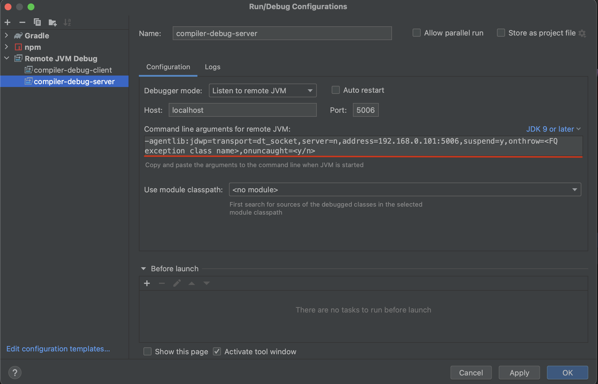

# Kotlin daemonology notes

This repository is a collection of notes about different useful things around [Kotlin compiler](https://github.com/JetBrains/kotlin) JS IR backend development. 

- [TL;DR](#tldr)
- [Gradle for kotlin compiler](#gradle-for-kotlin-compiler)
- [Gradle for other projects](#gradle-for-other-projects)
- [JVM control](#jvm-control)
- [JMC](#jmc)
- [Daemons](#daemons)
- [Debugging](#debugging)
- [Profiling](#profiling)
- [Heap dump](#heap-dump)
- [Benchmarking](#benchmarking)

## TL;DR
- [build](#building) and install Kotlin [from sources](https://github.com/JetBrains/kotlin) to [local maven repository](#using-kotlin-from-local-maven-repository):
   ```bash
   $ ./gradlew install
   ```
- run [Kotlin compiler JS IR tests](#compiler-tests):
   ```bash
   $ ./gradlew --parallel --project-dir js/js.tests jsIrTest
   ```
- show all available gradle tasks:
   ```bash
   $ ./gradlew -q :tasks --all
   ```
- [clean everything](#gradle-clean):
   ```bash
   $ rm -rf .gradle && find . -name 'build' | grep -v ".git" | xargs rm -rf
   ```
- [show all Kotlin daemons](#searching-daemons):
   ```bash
   $ jps | grep KotlinCompileDaemon
   ```
- [stop all Gradle and Kotlin daemons](#stopping-daemons):
   ```bash
   $ jps | grep -E 'GradleDaemon|KotlinCompileDaemon' | cut -f 1 -d' ' | xargs kill -9
   ```
- start Kotlin daemon with [debugger server](#ide-as-a-client-and-kotlin-daemon-as-a-server):
   ```bash
   $ ./gradlew -Dkotlin.daemon.jvm.options=-agentlib:jdwp=transport=dt_socket\\,server=y\\,suspend=y\\,address=5006 :${Kotlin JS Task}
   ```
- start Kotlin daemon with [debugger client](#ide-as-a-server-and-kotlin-daemon-as-a-client):
   ```bash
   $ ./gradlew -Dkotlin.daemon.jvm.options=-agentlib:jdwp=transport=dt_socket\\,server=n\\,address=localhost:5006\\,suspend=y :${Kotlin JS Task}
   ```
- start Kotlin daemon with/for [JFR](#java-flight-recorder):
   ```bash
   $ ./gradlew -Dkotlin.daemon.jvm.options=XX:+UnlockDiagnosticVMOptions,XX:+DebugNonSafepoints,XX:+FlightRecorder,XX:FlightRecorderOptions=stackdepth=2048 :${Kotlin JS Task} 
   ```
- start [JFR](#java-flight-recorder):
   ```bash
   $ jcmd ${KotlinCompileDaemon PID} JFR.start name=KotlinDemonProfile filename=/out/path/recording.jfr settings=profile maxsize=4GB
   ```
- stop [JFR](#java-flight-recorder):
   ```bash
   $ jcmd ${KotlinCompileDaemon PID} JFR.stop name=KotlinDemonProfile
   ```
- start Kotlin daemon with [Heap dump](#pass-jvm-args-explicitly):
   ```bash
   $ ./gradlew -Dkotlin.daemon.jvm.options=XX:+HeapDumpOnOutOfMemoryError,XX:HeapDumpPath=/path/to/heap_dump.hprof :${Kotlin JS Task}
   ```
- run [gradle-profiler](#benchmarking):
   ```bash
   $ gradle-profiler --benchmark --project-dir /path/to/project --scenario-file /path/to/scenario/file.scenarios 
   ```

## Gradle for kotlin compiler

### local.properties
My team-mates have strongly recommended me add the following `local.properties` file to my [kotlin](https://github.com/JetBrains/kotlin) local repository

```properties
org.gradle.java.installations.auto-detect=false
kotlin.build.isObsoleteJdkOverrideEnabled=true
kotlin.native.enabled=false
kotlin.build.disable.werror=true
kotlin.test.maxParallelForks=8
```

### Building
Build Kotlin [from sources](https://github.com/JetBrains/kotlin):
```bash
$ ./gradlew dist
```

Build Kotlin [from sources](https://github.com/JetBrains/kotlin) and install it into local maven repository (`$HOME/.m2` directory):
```bash
$ ./gradlew install
```

### Compiler tests
You can run tests from IDE - just press the green play button, however it is possible to run the tests from the console.

Run all JS IR tests from the console:
```bash
$ ./gradlew --parallel --project-dir js/js.tests jsIrTest
```

Also, you may add `-Pfd.kotlin.js.debugMode=2` option to you tests (in IDE it works as well).
If this option is enabled, compiler dumps IR after each lowering. They will be dumped to `js/js.tests/build/out/irBox/builtins/${testName}-irdump` directory.
Extremely useful for debugging!


There is another option `-Pfd.org.jetbrains.kotlin.compiler.ir.dump.strategy=KotlinLike` that makes the IR dump more readable (but less detailed).

TODO: Can I use it for non-test project build???

A piece of information about Kotlin JS tests can be found in Kotlin official repository [here](https://github.com/JetBrains/kotlin/blob/master/js/ReadMe.md) and [here](https://github.com/JetBrains/kotlin/tree/master/compiler/test-infrastructure#debugging-tests-js-and-wasm-only)


## Gradle for other projects

### Using kotlin from local maven repository

After [building](#building) and installing kotlin from sources you may use it for building other projects.

For that:
1) Add the following code to the beginning of `settings.gradle.kts` file:
   ```kotlin
   pluginManagement {
      repositories {
         gradlePluginPortal()
         mavenLocal()
      }
   }
   ```
2) Go through all `build.gradle.kts` files and
   1) add `mavenLocal()` near all `mavenCentral()` calls, it may look like:
       ```kotlin 
       allprojects {
           version = "0.1.1"
   
           repositories {
               mavenLocal()
               mavenCentral()
           }
       }
       ```
   2) set kotlin and plugin version to `1.X.255-SNAPSHOT`, it may look like:
       ```kotlin
       plugins {
           kotlin("multiplatform") version "1.8.255-SNAPSHOT" apply false
           kotlin("plugin.serialization") version "1.8.255-SNAPSHOT" apply false
       }
       ```

### Build your project
99.9% of all the things with gradle you can do from IDE, however you can also use a console.

To increase the compiler output verbosity you may add `--info` option to the gradle command.

In general there are two types of build:
- Development - no DCE, but it supports incremental compilation,
- Production - with DCE, incremental compilation options are ignored, and it also includes webpack (are you sure?).

The names of the gradle build tasks may be different for each project.
You may check the tasks name in IDE (`Gradle` button in the right top corner), or use the following command:

```bash
$ ./gradlew -q :tasks --all
```

#### Building [full-stack-web-jetbrains-night-sample](https://github.com/Kotlin/full-stack-web-jetbrains-night-sample)
Development build without DCE, but with the incremental compilation support
```bash
$ ./gradlew client:compileDevelopmentExecutableKotlinJs
```

Production build with Webpack(?)
```bash
$ ./gradlew client:compileProductionExecutableKotlinJs
```

### Gradle clean

If you do not trust `./gradlew clean` command, you can remove all build artifacts with the command:

**ATTENTION! IT MAY REMOVE MORE THAN YOU WANT! DO NOT USE THIS COMMAND IN KOTLIN LOCAL REPOSITORY**
```bash
$ rm -rf .gradle && find . -name 'build' | grep -v ".git" | xargs rm -rf
```

## JVM control
Here are the most useful JVM commands which allows controlling [your daemons](#daemons).

### jps
This command shows all JVM processes. I usually use it with `grep`.

Example:
```
$ jps
```

### jcmd
This is very nice tool, it helps to understand what is going on with Kotlin daemon. Read more [here](https://docs.oracle.com/javase/8/docs/technotes/guides/troubleshoot/tooldescr006.html).

The most interesting are: `VM.uptime`, `VM.flags`, `VM.system_properties`, `VM.command_line`, `JFR.*`.

Example:

```
jcmd ${PID} VM.uptime
```

## JMC

Must have tool! You can find it [here](https://www.oracle.com/java/technologies/javase/products-jmc8-downloads.html). 

It allows you to control and monitor the resources of [your daemons](#daemons):


Also, it may run [jcmd](#jcmd) commands from the UI:


And other helpful things.

## Daemons
You can say gradle to run everything in one process without daemons, but it is very slow!
If you still wanna do this, check the options (in `gradle.properties` or `local.properties` or through `-P{option key}={option value}`):
- `org.gradle.daemon=false` - do not start gradle daemon,
- `kotlin.compiler.execution.strategy=in-process` - do not start Kotlin daemon.

Usually gradle stars `GradleDaemon` which starts `KotlinCompileDaemon`, and this daemon does all Kotlin stuff.

Mostly you need to pass some extra options to Kotlin daemon, but before you need to find and stop him, so the next time Gradle daemon will start Kotlin daemon with your options.

### Searching daemons
Find Kotlin daemon PID:
```bash
$ jps | grep KotlinCompileDaemon
```

Q: What should I do if I see more than one KotlinCompileDaemon processes?

A: Usually I clean everything, [stop all daemons](#stopping-daemons) and run build task again.
If after that I still see more than one daemon, I use the daemon with the highest PID.

Find Gradle and Kotlin daemons:
```bash
$ jps | grep -E 'GradleDaemon|KotlinCompileDaemon' 
```

### Stopping daemons
Stop all daemon processes:
```bash
$ jps | grep -E 'GradleDaemon|KotlinCompileDaemon' | cut -f 1 -d' ' | xargs kill -9
```
Also, you may stop all JVM processes (it works fine for macOS, however on Linux it may kill your IDE as well):
```bash
$ killall -9 java
```

### Passing options to Gradle daemon
You may add or override option from `gradle.properties` or `local.properties` via `-P`.
For example, enable JS IR backend:
```bash
$ ./gradlew -Pkotlin.js.compiler=ir :${Kotlin JS Task}
```

### Passing options to Kotlin daemon JVM
You may pass options to Kotlin daemon JVM via `kotlin.daemon.jvm.options` (and `-D`!!!):
```bash
$ ./gradlew -Dkotlin.daemon.jvm.options=${any options separated by `,` without `-`} :${Kotlin JS Task}
```

## Debugging

### IDE as a client and Kotlin daemon as a server

1) Prepare a debug configuration in IDE, it should look like that:
   
2) Before continuing make sure, that there are no available [Kotlin daemons](#daemons).
3) Do not forget about breakpoints.
4) Start Kotlin daemon with the following JVM options (these options must correspond to options from debug config):
   ```bash
   $ ./gradlew -Dkotlin.daemon.jvm.options=-agentlib:jdwp=transport=dt_socket\\,server=y\\,suspend=y\\,address=5006 :${Kotlin JS Task}
   ```
5) Go to IDE and connect with remove debugger to Kotlin daemon.
6) Wait the breakpoint trigger.
7) Enjoy!

### IDE as a server and Kotlin daemon as a client

1) Prepare a debug configuration in IDE, it should look like that:
   
2) Before continuing make sure, that there are no available [Kotlin daemons](#daemons).
3) From IDE start listing a debugger connection.
4) Do not forget about breakpoints.
5) Start Kotlin daemon with the following JVM options (these options must correspond to options from debug config):
   ```bash
   $ ./gradlew -Dkotlin.daemon.jvm.options=-agentlib:jdwp=transport=dt_socket\\,server=n\\,address=localhost:5006\\,suspend=y :${Kotlin JS Task}
   ```
   Note: You may use either the ip address (in the example it was **_192.168.0.101_**) from the IDE config or just _**localhost**_, both work fine.
6) Wait the breakpoint trigger.
7) Enjoy!

## Profiling

### Attaching from IDE

Works like a magic: just open `Profiler` tab, find you `KotlinCompileDaemon` process and attach.

If you can't find `Profiler` tab for some reasons - open `Actions` (for macOS: Command + Shift + A) and enter `Profiler`


Java flight recorder complains about stack depth, therefore it makes sense to tune and use it manually.

### Java flight recorder
Tune JFR for Kotlin daemon (Before starting make sure, that there are no available [Kotlin daemons](#daemons)):
```bash
$ ./gradlew -Dkotlin.daemon.jvm.options=XX:+UnlockDiagnosticVMOptions,XX:+DebugNonSafepoints,XX:+FlightRecorder,XX:FlightRecorderOptions=stackdepth=2048 :${Kotlin JS Task}
```
- `+UnlockDiagnosticVMOptions` and `+DebugNonSafepoints` - in the internet it is written, that this options improve the profiling quality, I have no idea if it is true.
- `+FlightRecorder` - enable JFR, TODO: Should the option be explicitly used?
- `FlightRecorderOptions` - tune JFR, set stack depth. This option is must have!

Do not forget about JVM warming up!

Start-stop JFR:
```bash
$ jcmd ${KotlinCompileDaemon PID} JFR.start name=KotlinDemonProfile filename=/out/path/recording.jfr settings=profile maxsize=4GB
# do the compilation
$ jcmd ${KotlinCompileDaemon PID} JFR.stop name=KotlinDemonProfile
```

You can use this combination for small projects:
```bash
$ jcmd ${KotlinCompileDaemon PID} JFR.start name=KotlinDemonProfile filename=/out/path/recording.jfr settings=$JAVA_HOME/lib/jfr/profile.jfc maxsize=4GB && \
  ./gradlew -Dkotlin.daemon.jvm.options=XX:+UnlockDiagnosticVMOptions,XX:+DebugNonSafepoints,XX:+FlightRecorder,XX:FlightRecorderOptions=stackdepth=2048 :${Kotlin JS Task} && \
  jcmd ${KotlinCompileDaemon PID} JFR.stop name=KotlinDemonProfile
```

### Links:

[How to run JFR from code](https://bell-sw.com/announcements/2021/01/29/JDK-Flight-Recorder-The-Programmatic-Way/)

[Commands for jcmd JFR ](https://docs.oracle.com/javacomponents/jmc-5-5/jfr-command-reference/diagnostic-command-reference.htm)

## Heap dump

### OOM investigation

If you wanna understand what goes wrong and why compiler has eaten all memory, you need to ask JVM to generate heap dump on OOM.

#### Check the default JVM args
But before, inspect the current JVM args, it is very possible, that required options are already passed implicitly.
You can do this with the `jcmd` command:
```bash
$ jcmd ${KotlinCompileDaemon PID} VM.command_line
```

I've got the following:
```
jvm_args:
  -Djava.awt.headless=true
  -D$java.rmi.server.hostname=127.0.0.1
  -Xmx4g
  -XX:MaxMetaspaceSize=768m
  -Dkotlin.environment.keepalive
  -ea
  -XX:+HeapDumpOnOutOfMemoryError
  -XX:HeapDumpPath=/var/folders/wf/6rs371f93c33q3kl3ygxs4500000kt/T/
```

so I can find heap dumps in `/var/folders/wf/6rs371f93c33q3kl3ygxs4500000kt/T/` directory:
```bash
$ ls -la /var/folders/wf/6rs371f93c33q3kl3ygxs4500000kt/T/ | grep java
```

a heap dump should look like `java_pid${KotlinCompileDaemon PID}.hprof`.

#### Pass JVM args explicitly
If `HeapDumpOnOutOfMemoryError` and `HeapDumpPath` are not specified implicitly, you can pass them explicitly to Kotlin daemon
(Before starting make sure, that there are no available [Kotlin daemons](#daemons)):
```bash
$ ./gradlew -Dkotlin.daemon.jvm.options=XX:+HeapDumpOnOutOfMemoryError,XX:HeapDumpPath=/path/to/heap_dump.hprof :${Kotlin JS Task}
```

### Manually
Also heap dump can be generated manually via `jcmd`:
```bash
$ jcmd ${KotlinCompileDaemon PID} GC.heap_dump /path/to/heap_dump.hprof
```

### Links

[About heap dump](https://www.baeldung.com/java-heap-dump-capture)

## Benchmarking

[Gradle profiler](https://github.com/gradle/gradle-profiler) is good for benchmarking,
however I'm still not sure if it is possible to use it for Kotlin daemon profiling,
because it runs profilers only for Gradle daemon and profiles them.

### Legacy vs IR vs IR + IC scenarios

Here is a template. Feel free to copy-paste-modify it.
Do not forget to set `${Kotlin JS Task}`.
Also, you may wanna add extra `gradle-args` options, like `--info` or tune JVM arguments via `jvm-args`.
```
clean_build_legacy {
    title = "Legacy: clean build"
    tasks = [":${Kotlin JS Task}"]
    cleanup-tasks = ["clean"]
    gradle-args = [
        "-Pkotlin.js.compiler=legacy",
    ]
    jvm-args = [
        "-Xmx6g", 
        "-XX:+UseParallelGC"
    ]
    clear-build-cache-before = SCENARIO
    clear-configuration-cache-state-before = SCENARIO
    clear-transform-cache-before = SCENARIO
    clear-project-cache-before = SCENARIO
    show-build-cache-size = true
    iterations = 4
    warm-ups = 2
}
clean_build_ir {
    title = "IR: clean build"
    tasks = [":${Kotlin JS Task}"]
    cleanup-tasks = ["clean"]
    gradle-args = [
        "-Pkotlin.js.compiler=ir",
        "-Pkotlin.incremental.js.klib=false",
        "-Pkotlin.incremental.js.ir=false"
    ]
    jvm-args = [
        "-Xmx6g", 
        "-XX:+UseParallelGC"
    ]
    clear-build-cache-before = SCENARIO
    clear-configuration-cache-state-before = SCENARIO
    clear-transform-cache-before = SCENARIO
    clear-project-cache-before = SCENARIO
    show-build-cache-size = true
    iterations = 4
    warm-ups = 2
}
clean_build_ir_ic {
    title = "IR IC: clean build"
    tasks = [":${Kotlin JS Task}"]
    cleanup-tasks = ["clean"]
    gradle-args = [
        "-Pkotlin.js.compiler=ir",
        "-Pkotlin.incremental.js.klib=true",
        "-Pkotlin.incremental.js.ir=true"
    ]
    jvm-args = [
        "-Xmx6g", 
        "-XX:+UseParallelGC"
    ]
    clear-build-cache-before = SCENARIO
    clear-configuration-cache-state-before = SCENARIO
    clear-transform-cache-before = SCENARIO
    clear-project-cache-before = SCENARIO
    show-build-cache-size = true
    iterations = 4
    warm-ups = 2
}
```

You may run benchmarking with the following command:
```bash
$ gradle-profiler --benchmark --project-dir /path/to/project --scenario-file /path/to/scenario/file.scenarios
```
